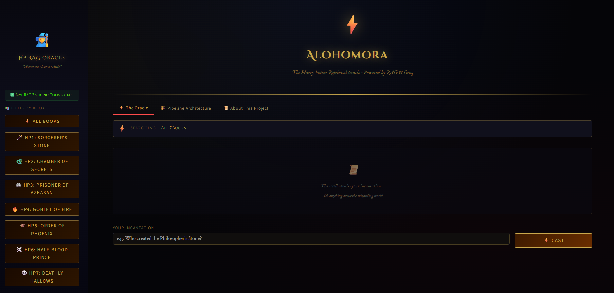
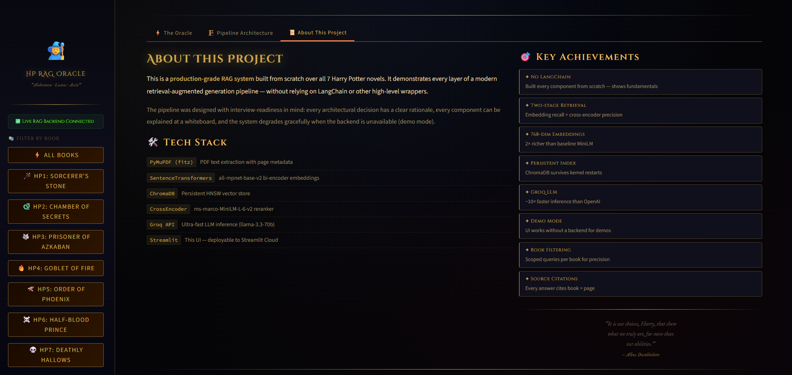
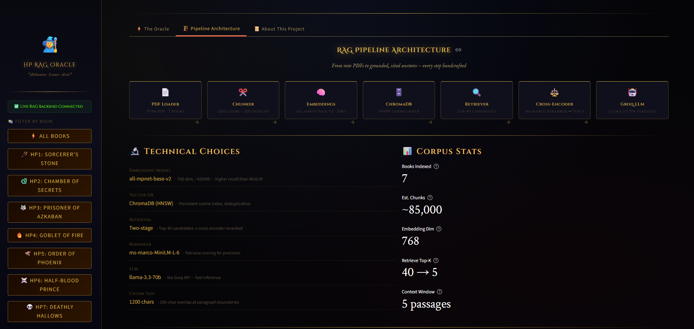

# 🧙 Harry Potter RAG Oracle

> A production-grade **Retrieval-Augmented Generation (RAG)** system built over all 7 Harry Potter novels — featuring two-stage retrieval, cross-encoder reranking, Groq LLM inference, and a dark magical Streamlit UI.

<p align="center">
  
</p>

<p align="center">
  
  
  
  
  
</p>

---

## 🎯 What It Does

Ask any question about the Harry Potter universe. The system retrieves the most relevant passages from across all 7 books, reranks them for precision, and generates a grounded answer — with exact book title and page number cited for every response.

```
Question  →  "Who gave Harry the invisibility cloak?"

Pipeline  →  Embed query → ChromaDB retrieves Top-40 candidates
          →  Cross-encoder reranks → Top-5 passages selected
          →  LLaMA-3.3-70B generates grounded answer via Groq

Answer    →  "Dumbledore gave Harry the Invisibility Cloak..."
Sources   →  HP1: Sorcerer's Stone p.259  ·  HP3: Prisoner of Azkaban p.364
```

---

## ✨ Features

- **Grounded answers with citations** — every response cites book + page number
- **Book-level filtering** — scope any query to a specific HP book (HP1–HP7)
- **Two-stage retrieval** — fast semantic search + precise cross-encoder reranking
- **Persistent vector index** — ChromaDB HNSW index built once, loads in seconds
- **Harry Potter themed UI** — dark magical Streamlit interface with house colors and gold accents
- **Pipeline Architecture tab** — visual diagram of every system component
- **Demo mode** — UI runs with mock responses when backend is unavailable

---

## 🏗️ Architecture

```
📄  7 HP PDFs
      │
      ▼
  [1] PDF Loader ────────── PyMuPDF · page-level metadata tagging
      │
      ▼
  [2] Text Chunker ───────── 1,200 chars · 200-char paragraph-aware overlap
      │
      ▼
  [3] Embedding Model ────── all-mpnet-base-v2 · 768-dim · SentenceTransformers
      │
      ▼
  [4] ChromaDB ───────────── Persistent HNSW cosine index · ~85,000 vectors
      │
      ▼
  [5] Retriever ──────────── Query embedding → Top-40 semantic candidates
      │
      ▼
  [6] Cross-Encoder ──────── ms-marco-MiniLM-L-6-v2 · pairwise reranking → Top-5
      │
      ▼
  [7] Groq LLM ───────────── llama-3.3-70b-versatile · grounded cited response
```

---

## 🛠️ Tech Stack

| Layer | Technology | Detail |
|---|---|---|
| PDF Extraction | PyMuPDF (fitz) | Page-level text + metadata |
| Embeddings | all-mpnet-base-v2 | 768-dim, ~420MB |
| Vector Store | ChromaDB (HNSW) | Persistent cosine index |
| Reranker | ms-marco-MiniLM-L-6-v2 | Cross-encoder pairwise scoring |
| LLM | llama-3.3-70b via Groq | Fast inference API |
| UI | Streamlit | Deployable to Streamlit Cloud |

---

## 📸 Screenshots

<p align="center">
  
  
</p>

---

## 🚀 Quick Start

### 1. Clone & install
```bash
git clone https://github.com/SWASTHI-SINGH/llm-rag-question-answering-system.git
cd llm-rag-question-answering-system
pip install -r requirements.txt
```

### 2. Set up environment
```bash
# Create .env file with your Groq API key
echo "GROQ_API_KEY=your_key_here" > .env
```
Get a free key at [console.groq.com](https://console.groq.com)

### 3. Add HP PDFs to `pdf/` folder
```
pdf/Harry_Potter_and_the_Sorcerers_Stone.pdf
pdf/Harry_Potter_and_the_Chamber_of_Secrets.pdf
pdf/Harry_Potter_and_the_Prisoner_of_Askaben.pdf
pdf/Harry_Potter_and_the_Goblet_of_Fire.pdf
pdf/Harry_Potter_and_the_Order_of_the_Phoenix.pdf
pdf/Harry_Potter_and_the_Half_Blood_Prince.pdf
pdf/Harry_Potter_and_the_Deathly_Hallows.pdf
```

### 4. Build the index (first time only — ~15 min)
```bash
jupyter notebook harry_potter_rag_v3.ipynb
# Kernel → Restart & Run All
# Embeds ~85,000 chunks into ChromaDB — cached forever after
```

### 5. Launch the UI
```bash
streamlit run app.py
# Opens at http://localhost:8501
```

---

## 📁 Project Structure

```
├── harry_potter_rag_v3.ipynb   # Full RAG pipeline — PDF → ChromaDB → Groq
├── app.py                      # Streamlit UI (Harry Potter themed)
├── rag_core.py                 # Bridge: pipeline logic → Streamlit
├── requirements.txt
├── .env.example                # Template — copy to .env and add your key
├── .gitignore
├── assets/                     # UI screenshots for README
├── pdf/                        # HP PDFs (not committed — copyright)
├── data/
│   ├── chunks.pkl              # Cached text chunks
│   └── vector_store/           # ChromaDB HNSW index
└── models/
    └── embedding_model/        # Cached all-mpnet-base-v2
```

---

## ☁️ Deploy to Streamlit Cloud

1. Push this repo to GitHub
2. Go to [share.streamlit.io](https://share.streamlit.io) → Connect repo → Select `app.py`
3. Add `GROQ_API_KEY` under **Secrets**
4. Deploy — live URL in under 2 minutes

---

## 💡 Design Decisions

| Decision | Rationale |
|---|---|
| 768-dim embeddings | Richer semantic space than 384-dim baseline — better recall on implicit queries |
| Two-stage retrieval | Embedding search is fast but approximate; cross-encoder catches nuance |
| Groq over hosted APIs | ~10× faster inference — critical for real-time UX |
| Persistent ChromaDB | Index built once (~15 min), reloads in seconds on every subsequent run |
| Demo mode | UI fully functional without backend — useful for portfolio demos |

---

## 📄 License

MIT — see [LICENSE](LICENSE)
